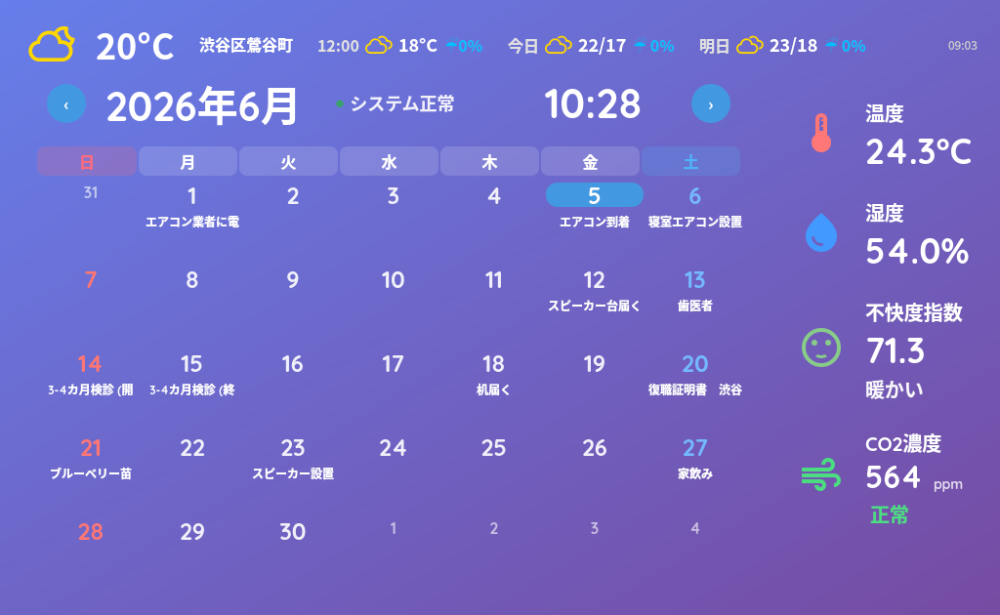
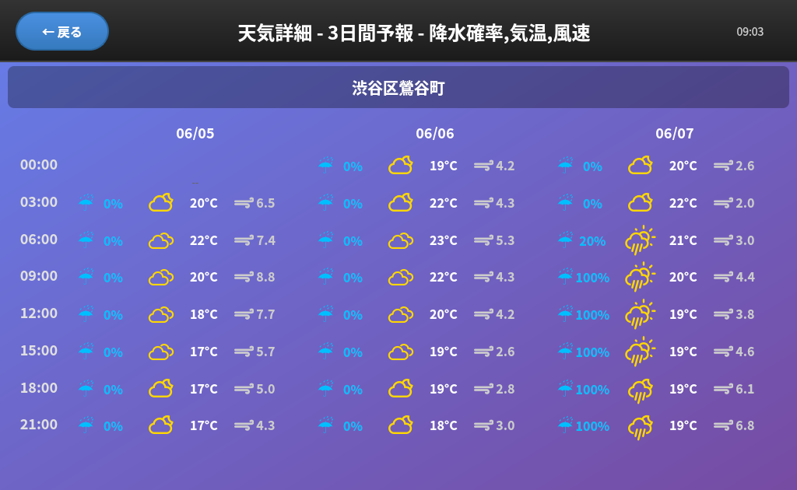
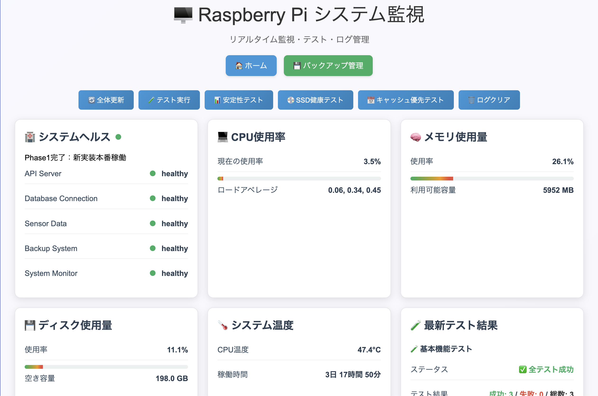
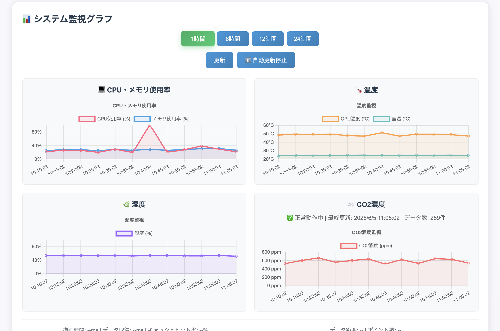
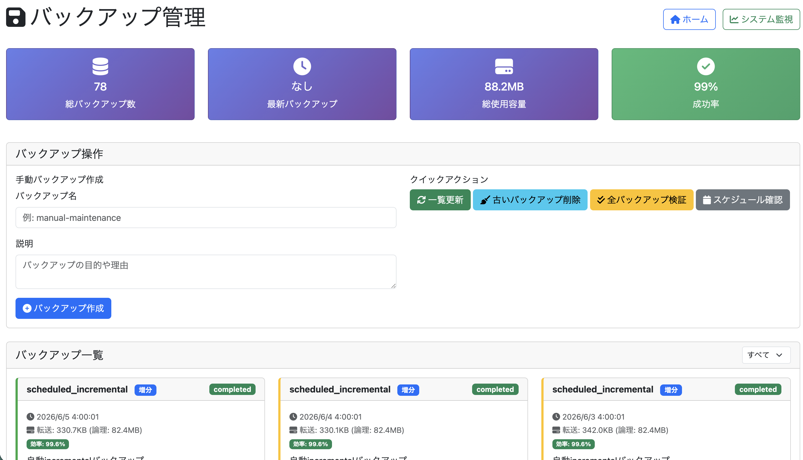

# Raspberry Pi Dashboard

Raspberry Pi 5 上で動作する、室内環境センサーと Google Calendar を統合したホームダッシュボードです。

## 背景

毎年カレンダーを買い替えるのが面倒になり、机に置ける「自動更新されるカレンダー」が欲しくなったのが出発点です。

せっかくなら自分の予定（Google Calendar）も表示したい → しかし Google Calendar だけでは日本の祝日が正しく表示できない問題があった → それなら温度・湿度・CO2 も知りたい → 湿度がわかるなら加湿器と連動させたい → 常時稼働するなら CPU・メモリ・センサーの死活監視も欲しい → データを守るためのバックアップ管理も必要、という具合に機能が積み上がりました。

## 開発について

本プロジェクトは設計段階から AI を積極的に活用して開発しました。[Claude Code](https://claude.ai/code) や [Kiro](https://kiro.dev) など複数の AI ツールを試しながら、どのように AI と協働すると効果的かを探る実験的な側面もあります。実装・デバッグ・リファクタリングだけでなく、要件定義や設計の段階から AI との対話を通じて進めており、個人開発における AI 活用の実践例でもあります。

Kiro で作成した設計・要件定義ドキュメントを [`docs/kiro-specs/`](docs/kiro-specs/) に公開しています。

## スクリーンショット

### メイン画面


### 天気詳細画面


### システム監視画面



### バックアップ管理画面


## アーキテクチャ

```
SHT35 (I2C)  ─┐
MH-Z19E (UART)─┴─→ monitoring_collector.py ─→ metrics.json
                                                      ↓
Google Calendar API ──────────────────────→ Flask API (app.py)
OpenWeatherMap API ────────────────────────────────────↓
Tapo スマートプラグ ←── humidifier_control  ←── PyQt5 Dashboard (dashboard.py)
```

## 機能

- **室内環境モニタリング** — SHT35 センサーによる温度・湿度のリアルタイム計測、不快度指数の算出
- **CO2 濃度モニタリング** — MH-Z19E センサーによる CO2 濃度計測・アラート
- **Google Calendar 連携** — 個人カレンダー・家族共有カレンダーの予定をダッシュボードに表示（キャッシュ優先表示でオフライン時も継続動作）
- **天気予報** — 3日間の天気・気温・降水確率・風速の時間帯別表示
- **加湿器自動制御** — Tapo スマートプラグ経由で湿度に連動した加湿器の ON/OFF 制御、夜間停止機能付き
- **システム監視** — CPU・メモリ・ディスク・温度のリアルタイム監視、APIヘルスチェック、安定性テスト（`http://raspberrypi.local:5000/system_monitor.html`）
- **バックアップ管理** — 増分バックアップの自動実行・一覧表示・復元・検証（`http://raspberrypi.local:5000/backup`）

## 使用技術

| カテゴリ | 技術 |
|---|---|
| ハードウェア | Raspberry Pi 5, 7インチタッチスクリーン (1024×600), SHT35 (I2C), MH-Z19E (UART), Tapo P110M |
| バックエンド | Python 3.11, Flask 3.0 |
| フロントエンド (デスクトップUI) | PyQt5 |
| 外部API | Google Calendar API, OpenWeatherMap (天気) |
| 認証 | Google OAuth2 / サービスアカウント |
| 自動起動 | systemd |

## セットアップ

### 必要環境

- Raspberry Pi 5
- 7インチタッチスクリーン (1024×600, HDMI+USB接続)
- Python 3.11+
- SHT35 センサー (I2C バス)
- MH-Z19E CO2 センサー (UART `/dev/ttyAMA0`)

### インストール

```bash
git clone https://github.com/[username]/raspberry-pi-dashboard.git
cd raspberry-pi-dashboard
python3 -m venv .venv
source .venv/bin/activate
pip install -r requirements.txt
```

依存パッケージに `pydantic-settings` が含まれています。設定は起動時に検証され、**必須項目が未設定の場合はアプリが起動を拒否します**（`SECRET_KEY` など）。

コミット前の静的解析 hook をセットアップする場合（推奨）：

```bash
pip install flake8
bash scripts/setup/install_hooks.sh
```

### 設定

`.env.example` をコピーして `.env` を作成し、各値を設定してください。

```bash
cp .env.example .env
```

詳細は `.env.example` を参照してください。主要項目：

```env
# [必須] 未設定だと起動しない
SECRET_KEY=your-secret-key-here

# Google Calendar（認証トークンは credentials/token.json に配置）
GOOGLE_CALENDAR_ID=primary
GOOGLE_ADDITIONAL_CALENDAR_IDS=   # カンマ区切りで追加カレンダーID（家族共有等）

# 天気予報（未設定だと天気が表示されない）
OPENWEATHERMAP_API_KEY=your-openweathermap-api-key
WEATHER_LOCATION_NAME=渋谷区
WEATHER_LATITUDE=35.652875
WEATHER_LONGITUDE=139.701595
```

`[必須]` 以外の項目はすべてデフォルト値があるため、省略可能です。

### Google Calendar 認証

サービスアカウント認証を使用します（OAuth2 の 7 日間トークン期限切れ問題を回避するため）。

1. [Google Cloud Console](https://console.cloud.google.com/) でプロジェクトを作成し、**Google Calendar API** を有効化
2. 「IAM と管理」→「サービスアカウント」でサービスアカウントを作成
3. 作成したサービスアカウントの「キー」→「鍵を追加」→ JSON 形式でダウンロード
4. ダウンロードしたファイルを `credentials/service-account-key.json` として配置
5. Google Calendar の設定画面でサービスアカウントのメールアドレス（`xxx@xxx.iam.gserviceaccount.com`）をカレンダーの「特定のユーザーとの共有」に追加（権限: 予定の閲覧）

### 起動

**API サーバー:**
```bash
python3 app.py
```

**PyQt5 ダッシュボード:**
```bash
python3 dashboard.py
```

**systemd での自動起動:**
```bash
sudo cp systemd/raspberry-pi-api-server.service /etc/systemd/system/
sudo cp systemd/raspberry-pi-native-dashboard.service /etc/systemd/system/
sudo systemctl enable raspberry-pi-api-server
sudo systemctl enable raspberry-pi-native-dashboard
sudo systemctl start raspberry-pi-api-server
sudo systemctl start raspberry-pi-native-dashboard
```

## ディレクトリ構成

```
raspberry-pi-dashboard/
├── app.py                     # Flask API サーバー（エントリーポイント）
├── dashboard.py               # PyQt5 デスクトップダッシュボード（エントリーポイント）
├── sensor.py                  # SHT35 センサー制御
├── mhz19e.py                  # MH-Z19E CO2 センサー制御
├── google_calendar_service.py # Google Calendar API クライアント
├── calendar_cache_priority.py # キャッシュ優先表示システム
├── simple_system_monitor.py   # システムメトリクス収集
├── humidifier_control/        # 加湿器制御モジュール
├── web_apps/                  # Flask Blueprint (API エンドポイント)
├── ui/                        # PyQt5 UI コンポーネント
├── logic/                     # ビジネスロジック
├── scripts/                   # cron スクリプト・ユーティリティ
├── static/                    # Web UI アセット
├── templates/                 # HTML テンプレート
├── systemd/                   # systemd サービスファイル
├── tests/                     # テストスイート
├── docs/                      # スクリーンショット・設計ドキュメント
├── credentials/               # 認証情報置き場 (git 管理外)
└── .env.example               # 環境変数サンプル
```
