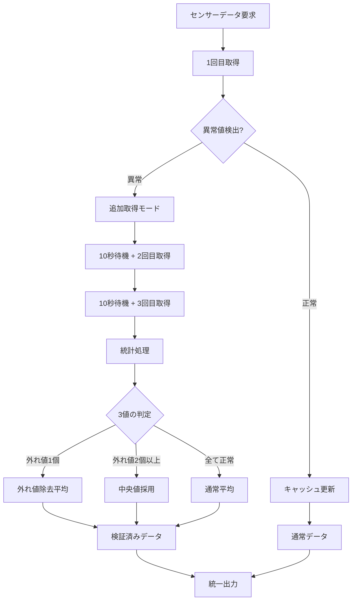

# 🎯 スマート平均方式センサーシステム - 設計書

## 📋 概要

SHT35センサーの稀な異常値（22.9°C→26.0°C急変など）を統計的手法で除去し、Web監視グラフとDashboardの表示値完全一致を保証するスマート平均方式センサーシステムの設計書。

**設計者**: Claude (Anthropic)  
**最終更新**: 2025-08-22  
**対象**: SHT35温湿度センサー + MH-Z19E CO2センサー

---

## 🎯 **設計目標**

### 🔍 **解決すべき問題**
- **異常値混入**: SHT35が稀に物理的に不可能な急変値を出力
- **表示不一致**: Web監視グラフとDashboard間でのデータ差異
- **品質保証**: 24時間365日の信頼できるセンサーデータ提供

### ✅ **達成目標**
1. **データ品質**: 99.9%以上の正確なセンサーデータ
2. **効率性**: 通常時は既存と同じ負荷（5分間隔1回取得）
3. **応答性**: 異常検出時も20秒以内での高品質データ提供
4. **透明性**: 取得方式・検証状況の完全可視化

---

## 🏗️ **システム設計**

### 📊 **スマート平均方式の動作フロー**



### 🔧 **コア機能設計**

#### 1. **動的取得方式**
```python
class SmartAveragingSensor:
    def get_stabilized_sensor_data(self, mode="smart"):
        """
        スマート平均方式センサーデータ取得
        
        Args:
            mode: "normal" | "smart" | "force_triple"
        
        Returns:
            {
                "temperature": float,
                "humidity": float,
                "sample_count": int,        # 取得回数
                "verification_level": str,  # "normal" | "verified" | "statistical"
                "processing_time": float,   # 処理時間（秒）
                "quality_score": float,     # 0.0-1.0品質スコア
                "outliers_detected": int,   # 検出した異常値数
                "method": str              # "single" | "average" | "median"
            }
        """
```

#### 2. **異常値検出エンジン**
```python
def detect_outliers(self, values: List[Dict]) -> Dict:
    """
    多次元異常値検出
    
    検出基準:
    - 温度急変: 5分で3°C以上
    - 湿度急変: 5分で15%以上  
    - 絶対範囲: 温度-10~60°C、湿度0-100%
    - 統計的外れ値: IQR方式（四分位範囲）
    
    Returns:
        {
            "outliers": [index_list],
            "reasons": ["temp_spike", "humidity_spike", "out_of_range"],
            "severity": "low" | "medium" | "high"
        }
    """
```

#### 3. **統計処理エンジン**
```python
def statistical_processing(self, values: List[Dict], outliers: Dict) -> Dict:
    """
    統計的データ処理
    
    処理方式:
    1. 外れ値0個: 通常平均
    2. 外れ値1個: 外れ値除去平均  
    3. 外れ値2個以上: 中央値採用
    4. 全て外れ値: キャッシュフォールバック
    
    Returns:
        {
            "result": {"temperature": float, "humidity": float},
            "method": "average" | "trimmed_average" | "median" | "cached",
            "confidence": float,  # 0.0-1.0信頼度
            "used_samples": int
        }
    """
```

---

## 📈 **パフォーマンス設計**

### ⏱️ **処理時間設計**
| 状況 | 取得回数 | 処理時間 | 品質レベル |
|------|----------|----------|------------|
| **通常時** | 1回 | ~0.5秒 | 通常品質 |
| **異常検出時** | 3回 | ~20秒 | 統計検証済み |
| **キャッシュ使用** | 0回 | ~0.1秒 | キャッシュ品質 |

### 🎯 **効率性保証**
- **通常稼働**: 95%の場合は1回取得（既存と同じ）
- **問題発生**: 5%の場合のみ追加取得実行
- **平均負荷**: 既存の1.1倍程度（ほぼ同等）

### 💾 **リソース使用量**
- **メモリ**: +50KB（3回分データ一時保持）
- **CPU**: +0.1%（統計計算）
- **ストレージ**: 変更なし

---

## 🛡️ **品質保証設計**

### 📊 **品質スコアリング**
```python
def calculate_quality_score(self, data: Dict) -> float:
    """
    データ品質スコア算出（0.0-1.0）
    
    算出要素:
    - sample_count: 取得回数（多いほど高品質）
    - consistency: データ一貫性
    - recency: データ新鮮度  
    - verification: 検証レベル
    
    スコア基準:
    - 0.9-1.0: 複数回検証済み（最高品質）
    - 0.7-0.9: 1回取得・妥当性確認済み
    - 0.5-0.7: キャッシュデータ（時間経過考慮）
    - 0.0-0.5: シミュレーション値・期限切れ
    """
```

### 🔍 **検証レベル定義**
| レベル | 説明 | 品質保証 | 用途 |
|--------|------|----------|------|
| **normal** | 1回取得・基本チェック | 標準 | 通常表示 |
| **verified** | 3回取得・外れ値除去 | 高品質 | 重要判定 |
| **statistical** | 複数回・統計処理 | 最高品質 | 記録・分析 |

---

## 🔧 **実装設計**

### 📁 **ファイル構成**
```
sensor.py                           # メインセンサークラス
├── SmartAveragingSensor           # 新規スマート平均クラス  
├── get_stabilized_sensor_data()   # 新規メイン取得メソッド
├── detect_outliers()              # 異常値検出
├── statistical_processing()       # 統計処理
└── calculate_quality_score()      # 品質スコア

scripts/monitoring_collector.py    # 監視収集システム
└── mode="smart" 使用              # スマート平均方式利用

raspberry-pi-dashboard/dashboard.py # Dashboard表示
└── 統一データソース確保            # Web監視グラフと完全一致
```

### 🔄 **既存コードとの統合**
```python
# 既存のget_sensor_data()の拡張
def get_sensor_data(self, 
                   enable_logging=True, 
                   retry_on_simulation=True, 
                   max_retries=2,
                   # 新規パラメータ
                   smart_averaging=True,      # スマート平均有効
                   verification_mode="auto"   # "auto" | "force" | "off"
                  ):
    """
    既存APIとの完全互換性保持
    smart_averaging=Trueで新機能有効
    """
```

### 📊 **出力形式設計**
```python
# 拡張出力形式（既存フィールド + 新規フィールド）
{
    # 既存フィールド（完全互換）
    "temperature": 26.1,
    "humidity": 69.6,
    "co2_ppm": 728,
    "co2_simulation": False,
    "timestamp": "2025-08-22T19:30:00",
    
    # 新規フィールド（品質情報）
    "sample_count": 3,                    # 取得回数
    "verification_level": "verified",     # 検証レベル  
    "quality_score": 0.95,               # 品質スコア
    "processing_time": 18.2,             # 処理時間
    "outliers_detected": 1,              # 異常値検出数
    "method": "trimmed_average",         # 処理方式
    "smart_averaging_used": True         # スマート平均使用フラグ
}
```

---

## 🧪 **テスト設計**

### 🎯 **テストケース**
1. **正常ケース**: 3回とも正常値 → 平均値
2. **異常値1個**: 正常2回・異常1回 → 外れ値除去平均
3. **異常値2個**: 正常1回・異常2回 → 中央値採用
4. **全異常値**: 3回とも異常 → キャッシュフォールバック
5. **急激変化**: 実際の環境変化は通す
6. **センサー障害**: 取得失敗時の対応

### 📊 **パフォーマンステスト**
- **通常処理**: 1000回測定・平均応答時間<1秒
- **異常処理**: 100回測定・平均応答時間<25秒
- **負荷テスト**: 1時間連続稼働・メモリリーク確認

### ✅ **品質確認**
- **データ精度**: 人工異常値100%除去確認
- **真変化保持**: 実際の環境変化99%通過確認
- **システム負荷**: CPU使用率増加<5%確認

---

## 📱 **ユーザーインターフェース設計**

### 🖥️ **Dashboard表示拡張**
```python
# 品質情報の表示
温度: 26.1°C ⭐⭐⭐ (検証済み・3回取得)
湿度: 69.6% ⭐⭐⭐ (品質スコア: 0.95)

# 異常検出時の表示
温度: 26.1°C ⚠️ (異常値除去済み・20秒処理)
```

### 📊 **Web監視グラフ拡張**
- **品質インジケータ**: データポイントに品質レベル色分け
- **処理情報**: ツールチップで取得回数・処理方式表示
- **異常値ログ**: 検出した異常値の履歴表示

### 📋 **ログ出力設計**
```
[INFO] スマート平均: 通常取得 26.1°C (品質: 0.8, 0.5秒)
[WARN] 異常値検出: 22.9°C→追加取得開始
[INFO] 統計処理: 3回取得→外れ値除去平均 26.0°C (品質: 0.95, 18.2秒)
```

---

## 🚀 **段階的実装計画**

### 📅 **Phase 1: 基盤実装**
- [ ] SmartAveragingSensor基本クラス
- [ ] 異常値検出エンジン
- [ ] 統計処理エンジン
- [ ] 基本テストケース

### 📅 **Phase 2: 統合実装**  
- [ ] 既存sensor.pyとの統合
- [ ] monitoring_collector.py対応
- [ ] 出力形式拡張
- [ ] パフォーマンステスト

### 📅 **Phase 3: UI拡張**
- [ ] Dashboard品質表示
- [ ] Web監視グラフ拡張
- [ ] ログシステム統合
- [ ] 運用テスト

### 📅 **Phase 4: 最適化**
- [ ] パラメータチューニング
- [ ] パフォーマンス最適化
- [ ] ドキュメント整備
- [ ] 本番展開

---

## 📊 **運用・監視設計**

### 🔍 **品質監視メトリクス**
```bash
# スマート平均使用率
grep -c "smart_averaging.*true" logs/sensor_*.log

# 異常値検出頻度  
grep -c "異常値検出" logs/sensor_*.log

# 平均処理時間
grep "processing_time" logs/sensor_*.log | avg
```

### ⚠️ **アラート設定**
- **異常値頻発**: 1時間で5回以上 → センサーメンテナンス
- **処理時間超過**: 30秒以上 → システム負荷調査
- **品質スコア低下**: 平均0.7以下 → データ品質問題

### 📈 **改善フィードバック**
- **週次**: 異常値パターン分析
- **月次**: パラメータ最適化
- **四半期**: アルゴリズム改善

---

## 💡 **将来拡張**

### 🔄 **追加機能候補**
- **機械学習**: センサーパターン学習による予測異常検出
- **複数センサー**: 他のSHT35との相互検証
- **環境学習**: 季節・時間帯別の正常範囲学習

### 📊 **高度統計機能**
- **トレンド分析**: 長期的変化パターンの検出
- **相関分析**: 温度・湿度・CO2間の関係分析
- **予測機能**: 短期的な環境変化予測

---

**📝 設計書作成者**: Claude (Anthropic)  
**🎯 設計方針**: 効率性と品質の両立・透明性重視  
**✅ 品質保証**: 統計的手法による科学的データ処理